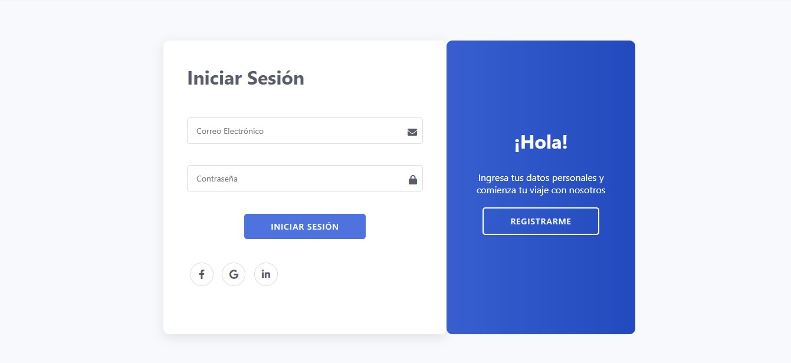
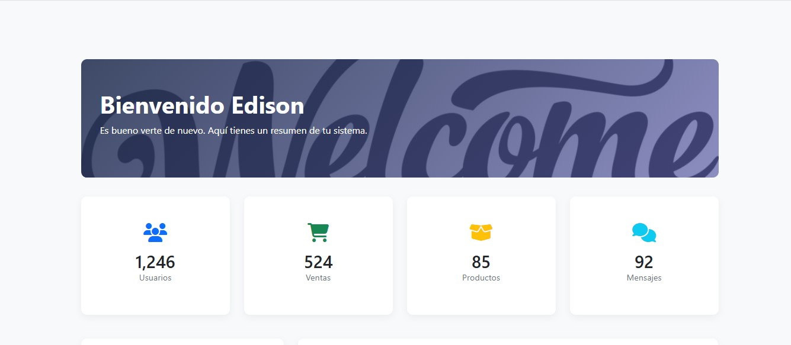

# **Proyecto de Autenticación con JWT en NODE**

[](https://nodejs.org/)
[](https://www.mongodb.com/)
[](https://getbootstrap.com/)
[](LICENSE)

---

## **Descripción del Proyecto**

Este proyecto es una aplicación web desarrollada en **Node.js** que implementa un sistema de autenticación seguro utilizando **JSON Web Tokens (JWT)** y **MongoDB**. La aplicación permite a los usuarios registrarse, iniciar sesión y acceder a un panel de administrador protegido mediante autenticación.

El objetivo principal de este proyecto es demostrar cómo implementar un sistema de autenticación robusto utilizando JWT, junto con un flujo de trabajo completo que incluye registro, inicio de sesión, validación de tokens y renderizado dinámico de vistas con **EJS**.

---

## **Características Principales**

✅ **Registro e Inicio de Sesión**:  
Los usuarios pueden crear una cuenta o iniciar sesión en la aplicación. Los datos de los usuarios se almacenan de forma segura en MongoDB.

🔒 **Autenticación con JWT**:  
Una vez que el usuario inicia sesión, se genera un token JWT que se utiliza para verificar su identidad y permitir el acceso al panel de administrador.

💻 **Panel de Administrador Protegido**:  
Solo los usuarios autenticados pueden acceder al panel de administrador, donde se renderiza contenido exclusivo utilizando **EJS** como motor de plantillas.

🎨 **Interfaz Moderna**:  
Diseñada con **Bootstrap**, la aplicación ofrece una experiencia de usuario limpia, intuitiva y responsiva.

🛡️ **Seguridad**:  
Implementación de buenas prácticas de seguridad, como cifrado de contraseñas con **Bcrypt** y manejo seguro de tokens JWT.

---

## **Tecnologías Utilizadas**

| Tecnología       | Descripción                                                                 |
|------------------|-----------------------------------------------------------------------------|
| **Node.js**      | Entorno de ejecución para construir la lógica del servidor.                 |
| **Express.js**   | Framework minimalista para manejar rutas y solicitudes HTTP.               |
| **MongoDB**      | Base de datos NoSQL para almacenar información de usuarios y otros datos.  |
| **Mongoose**     | ODM para interactuar con MongoDB de manera más eficiente.                  |
| **EJS**          | Motor de plantillas para renderizar vistas dinámicas en el lado del servidor. |
| **Bootstrap**    | Framework CSS para el diseño y maquetación de la interfaz de usuario.      |
| **JWT**          | Protocolo de autenticación para asegurar las sesiones de usuario.          |
| **Bcrypt**       | Biblioteca para el cifrado de contraseñas y protección de datos sensibles. |

---

## **Cómo Funciona**

1. **Registro**:  
   Los usuarios pueden crear una cuenta proporcionando un nombre de usuario, correo electrónico y contraseña. Las contraseñas se cifran antes de almacenarse en la base de datos.

2. **Inicio de Sesión**:  
   Al iniciar sesión, las credenciales se validan. Si son correctas, se genera un token JWT que se envía al cliente.

3. **Acceso al Panel de Administrador**:  
   Si el token JWT es válido, el usuario puede acceder al panel de administrador.
---

## Imágenes de demostración

Aquí puedes ver algunas imágenes de la interfaz de la aplicación:


*Login de la aplicación.*


*Dashboard del administrador.*

## **Instalación y Uso**

### **Requisitos Previos**

- Node.js (versión 18.x o superior)
- MongoDB instalado localmente o acceso a una instancia remota
- npm (gestor de paquetes de Node.js)

### **Pasos para Ejecutar el Proyecto**

1. **Clonar el Repositorio**:
   ```bash
   git clone https://github.com/EdisonGP/JWTNode.git
   cd tu-repositorio
   ```
2. Navega al directorio del proyecto:

    ```bash
    cd TU_REPOSITORIO
    ```

3. Inicia un repositorio Git (solo si es la primera vez que clonas el proyecto):

    ```bash
    git init
    ```

4. Instala las dependencias necesarias utilizando **npm**:

    ```bash
    npm install
    ```

5. Finalmente, ejecuta la aplicación:

    ```bash
    npm start
    ```
## Licencia

Este proyecto está licenciado bajo la **MIT License** - consulta el archivo [LICENSE](LICENSE) para más detalles.

---

**Desarrollado por Edison Guaichico** - [Perfil de GitHub](https://github.com/EdisonGP)
